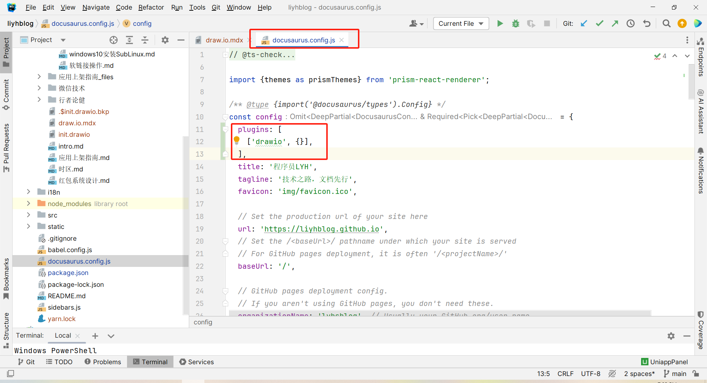
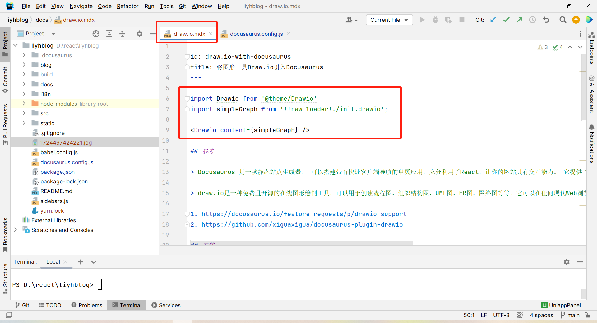
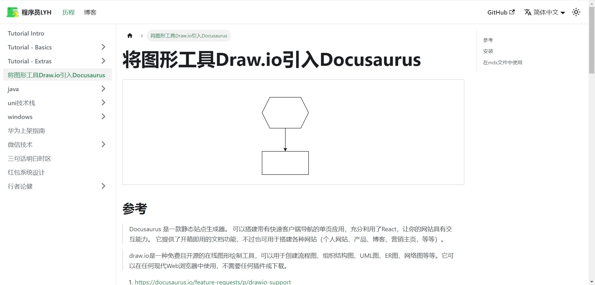

import Drawio from '@theme/Drawio'
import simpleGraph from '!!raw-loader!./init.drawio';

<Drawio content={simpleGraph} />

## 参考

> Docusaurus 是一款静态站点生成器。 可以搭建带有快速客户端导航的单页应用，充分利用了React，让你的网站具有交互能力。 它提供了开箱即用的文档功能，不过也可用于搭建各种网站（个人网站、产品、博客、营销主页，等等）。

> draw.io是一种免费且开源的在线图形绘制工具，可以用于创建流程图、组织结构图、UML图、ER图、网络图等等。它可以在任何现代Web浏览器中使用，不需要任何插件或下载。

1. https://docusaurus.io/feature-requests/p/drawio-support
2. https://github.com/xiguaxigua/docusaurus-plugin-drawio

## 安装

1. 安装插件docusaurus-plugin-drawio

在命令行中进入Docusaurus根目录输入:

`yarn add docusaurus-plugin-drawio`

or

`npm i docusaurus-plugin-drawio`

2. 配置插件

* 编辑 docusaurus.config.js

* 在插件中引入drawio



## 在mdx文件中使用

1. 引入

```jsx
import Drawio from '@theme/Drawio'
import simpleGraph from '!!raw-loader!./init.drawio';

<Drawio content={simpleGraph} />
```



2. 效果




