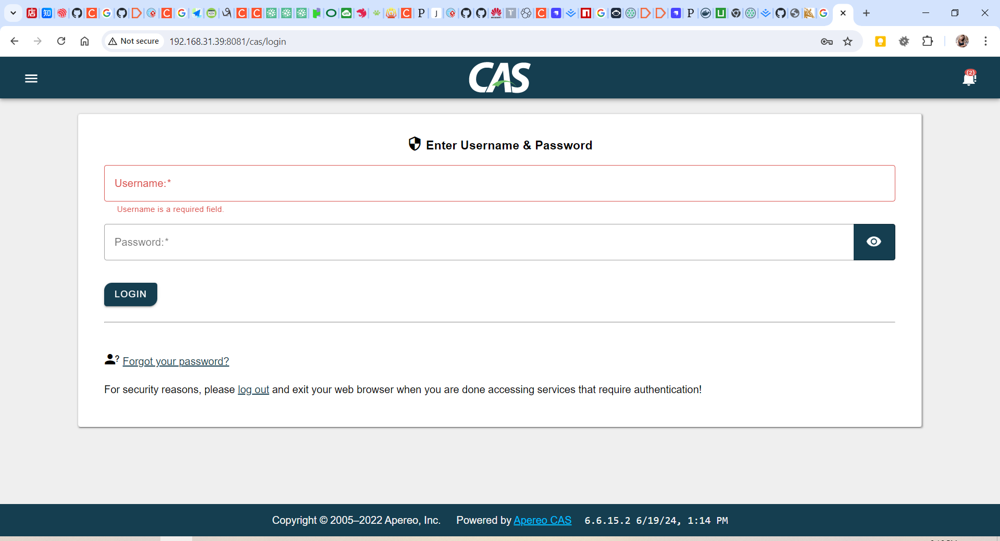
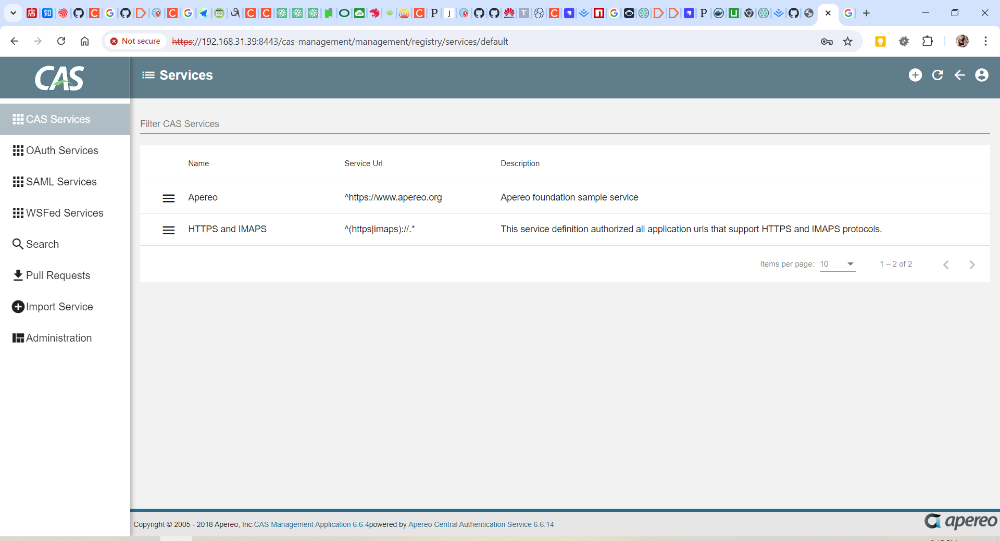

## 用docker方式搭建

> 背景介绍

### 参考：

1. https://github.com/apereo/cas
2. https://apereo.github.io/cas/6.6.x/
3. https://apereo.github.io/cas/6.6.x/installation/Docker-Installation.html
4. https://hub.docker.com/r/apereo/cas/

### 步骤:

#### 运行容器

```shell
docker pull apereo/cas:6.6.15.1

docker run --rm -e SERVER_SSL_ENABLED=false -e SERVER_PORT=8080 -p 8080:8080 --name casserver apereo/cas:6.6.15.2
```

#### 运行成功后修改配置文件

```shell

docker exec -it 容器id bash

vi /etc/cas/config/cas.properties

cas.service-registry.core.init-from-json=true # 启用JSON注册服务
cas.serviceRegistry.json.location=file:/etc/cas/services #JSON配置文件目录
cas.authn.oauth.grants.resourceOwner.requireServiceHeader=true
cas.authn.policy.requiredHandlerAuthenticationPolicyEnabled=false

vi /etc/cas/services/web-10000001.json

{
  "@class" : "org.apereo.cas.services.RegexRegisteredService",
  "serviceId" : "^(https|imaps|http)://.*",
  "name" : "web",
  "id" : 10000001,
  "evaluationOrder" : 10
}
```

**完成这些配置后重启容器cas就配置好了，访问 http://192.168.31.39:8081/cas/login 进入如管理界面 默认账号密码casuser/Mellon**



### 搭建管理端

> 管理端也是一个CAS的客户端也遵循单点登录

#### 参考

1. https://github.com/apereo/cas-management-overlay

#### 前置需求

1. linux系统
2. git需要安装
3. JDK11+

#### 构建War包

```shell
git clone https://github.com/apereo/cas-management-overlay.git
cd cas-management-overlay && git checkout 6.6


vi docker-run.sh
#!/bin/bash
# 如果在同一机器上面需要注意，这里开放的8080和8443和cas端口是一样的，你需要改端口
docker stop cas > /dev/null 2>&1
docker rm cas > /dev/null 2>&1
image_tag=(`cat gradle.properties | grep "casmgmt.version" | cut -d= -f2`)
docker run -d -p 8081:8080 -p 8443:8443 --name="cas-management" apereo/cas-management:"v${image_tag}"
docker logs -f cas-management


vi etc/cas/config/management.properties
cas.server.name=https://192.168.31.39:8080 #这里是cas服务器地址
cas.server.prefix=${cas.server.name}/cas
mgmt.server-name=https://192.168.31.39:8443 #这里是管理端的访问地址
mgmt.admin-roles[0]=ROLE_ADMIN
mgmt.user-properties-file=file:/etc/cas/config/users.json
logging.config=file:/etc/cas/config/log4j2-management.xml

# 生成一个名为thekeystore的证书

#!/bin/bash

if [[ -z "${CAS_KEYSTORE}" ]] ; then
  keystore="$PWD"/thekeystore
  echo -e "Generating keystore for CAS Server at ${keystore}"
  dname="${dname:-CN=localhost,OU=Example,OU=Org,C=US}"
  subjectAltName="${subjectAltName:-dns:example.org,dns:localhost,ip:127.0.0.1}"
  [ -f "${keystore}" ] && rm "${keystore}"
  keytool -genkey -noprompt -alias cas -keyalg RSA \
    -keypass changeit -storepass changeit \
    -keystore "${keystore}" -dname "${dname}"
  [ -f "${keystore}" ] && echo "Created ${keystore}"
  export CAS_KEYSTORE="${keystore}"
else
  echo -e "Found existing CAS keystore at ${CAS_KEYSTORE}"
fi

# 生成好之后将证书复制到 etc/cas目录
cp thekeystore etc/cas/thekeystore

# 脚本加执行权限
chmod +x *.sh
```

**管理端的配置就好了**

#### 构建容器环境

```shell
./docker-build.sh
```

#### 运行容器

```shell
./docker-run.sh
```

**访问 https://192.168.31.39:8443/cas-management 进入管理界面**

