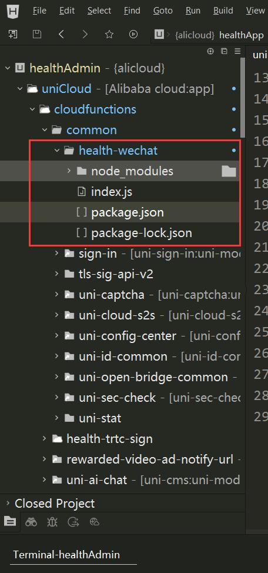
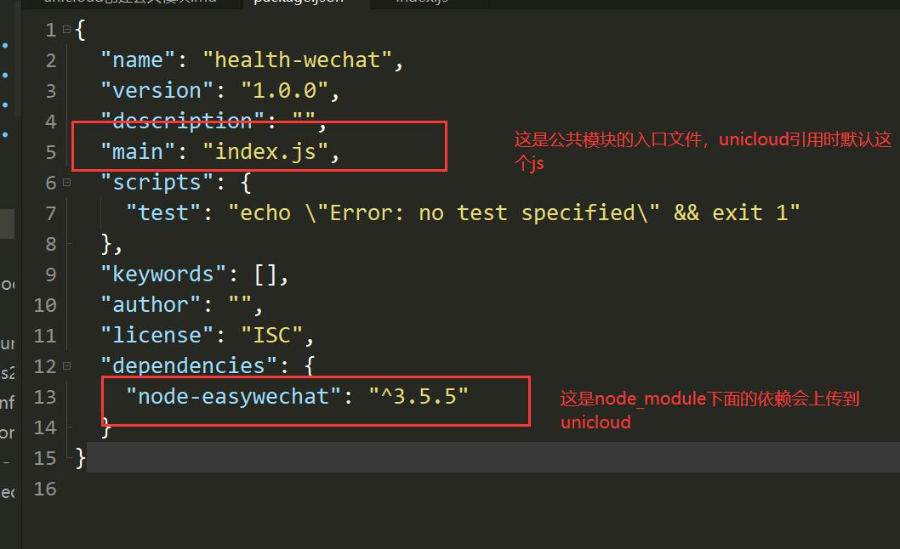
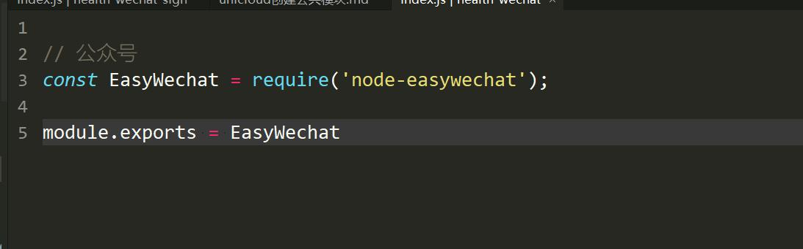

首先选中 `uniCloud/cloudfuctions` 右键 `creating cloud funciton / cloud object`

填写`模块名称` 并选中`默认模块` 点击完成创建

新模块目录下面会生成index.js 和package.json

`package.json` 时node_module的依赖配置文件

在这个里面安装的依赖可以上传到unicloud依赖中心

unicloud在解析index.js中的依赖时就可以在模块node_module下面读取文件

所以我们安装依赖就到这里面安装

例如我们创建一个 health-wechat模块

完成之后用命令行进入health-wechat目录

``` shell
cd project_root/uniCloud/cloudfuctions/health-wechat
//并且安装 node-easywechat
npm install -S node-easywechat
```

安装完成后目录如下图：





将依赖在index.js中适配完成后导出，如下图:

