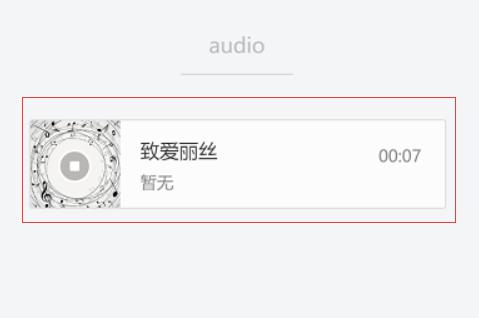
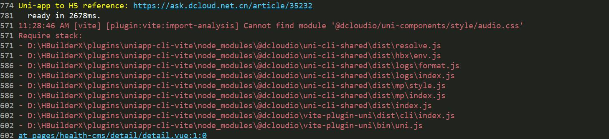
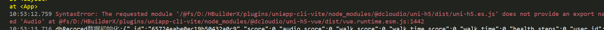

>无论什么产品都有不足的地方——唏嘘

## 事件起因(2023/12/08 09:35)

用户要求在h5上面文章详情页播放音频，拿到需求后就开始查询uni文档发现内置`audio`组件界面还不错



然后复制其文档中的代码到`detail.vue`

```javascript
<audio style="text-align: left" :src="current.src" :poster="current.poster" :name="current.name" :author="current.author" :action="audioAction" controls></audio>

export default {
	data() {
		return {
			current: {
				poster: 'https://qiniu-web-assets.dcloud.net.cn/unidoc/zh/music-a.png',
				name: '致爱丽丝',
				author: '暂无',
				src: 'https://bjetxgzv.cdn.bspapp.com/VKCEYUGU-hello-uniapp/2cc220e0-c27a-11ea-9dfb-6da8e309e0d8.mp3',
			},
			audioAction: {
				method: 'pause'
			}
		}
	}
}
```

配置好页面运行后控制台输出：

```log
11:28:46 AM [vite] [plugin:vite:import-analysis] Cannot find module '@dcloudio/uni-components/style/audio.css'
```



## 思路1 (09:40)

当时想找不到css可能是我的编辑器是2019年就安装的，过了4年了，虽然有热更新，但是难免不会有缺陷，缺个css就去错误提示中的目录创建一个`audio.css`，创建好后果然没有提示了。别慌接着提示JS模块未提供`Audio`对象X1，当时人麻了，这是UNI内置组件啊，竟然会没有！




## 发下牢骚 (10:02)

然后我就在uni开发者群里问,他们是否正常使用audio组件。没过多久，有热心人反馈他可以使用audio组件，并截图发证明。然后他提议安装一个全新的HbuilderX试试。

只得这样了。

接着安装、解压、运行、好在直接打开不用重新导入项目(证明HbuilderX共享得项目配置文件)、直接重新配置uniCloud空间，再让项目跑起来，期间提示安装新依赖sass、vue3的编译器等等。

但是依旧是同样的问题提示JS模块未提供`Audio`对象X2

证明这不是Hbuilder版本问题，心里小庆幸不用更新再用Hbuilder版本了，因为Hbuilder版本不一致需要重新打包调试基座，线上Apk也得重新打包更新：多一事不如少一事

如果编辑器版本没有问题那就是我的项目自身问题了。

## 思路2 (11:20)

思路就是新建立一个vue3的空白项目

将audio组件文档中得代码复制到空白项目并运行

依旧提示JS模块未提供`Audio`对象X3

问题到底在哪里呢，最后的尝试是更换VUE版本


## 落地解决方案(11:30)

在`minifest.json`中将vue版本从3改到2

重新运行项目组件正常工作了

**证明vue3无法使用audio组件**

## 总结

虽然uniapp让开发者可以快速开发一个项目，但是要做到多端兼容、多版本兼容、完美那是不可能的。使用者会遇到很多问题、这时需要定下心来思考问题所在，并一步一步的调试代码，思路放开一点。