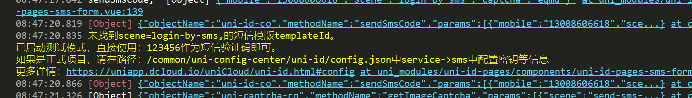
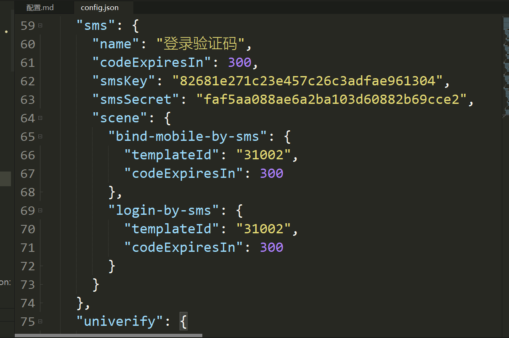

uni-id-pages
登录页面配置
uni-id-pages 提供三个页面登录
根目录pages.json文件 uniIdRouter.loginPage='具体登录页面'
具体登录页面在uni-modules/uni-id-pages/pages/login目录下面

一键登录模块 需要在uni后台开通, 
要添加应用并配置原生应用.keystore证书的md5 sha1 sha256, 
需要在云函数公共模块/uni-config-center/uni-id下面配置univerify这一项, 
appid: 是需要调用一键登录的应用ID, 
apiKey, apiSecret, 是一键登录开通后业务中给的密钥 

[隐私策略弹窗配置参考](https://uniapp.dcloud.net.cn/uniCloud/uni-starter.html#_9-%E9%9A%90%E7%A7%81%E6%94%BF%E7%AD%96%E5%BC%B9%E6%A1%86)

配置登录方式，是在uni-id-pages/config.js

开启短信登录需要配置短信登录模板见下图

更新说明

WTG更新选择`静默更新`+`替换线上版本`

APK整包更新，不要选择静默更新，可选`强制更新`+`替换线上版本`

