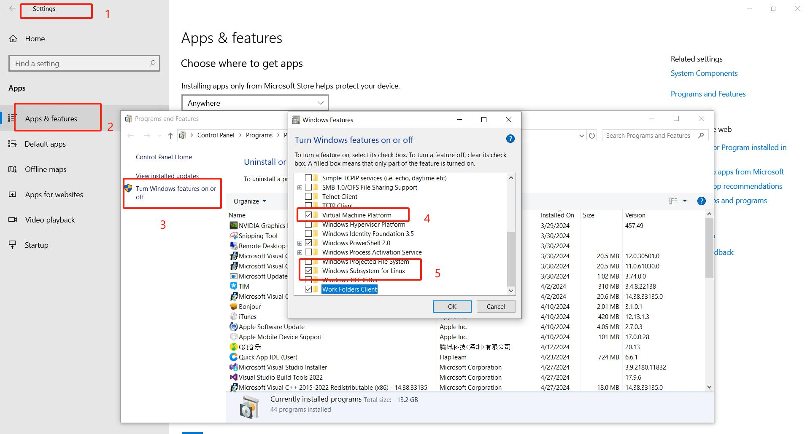
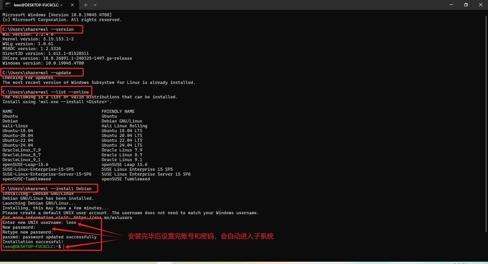
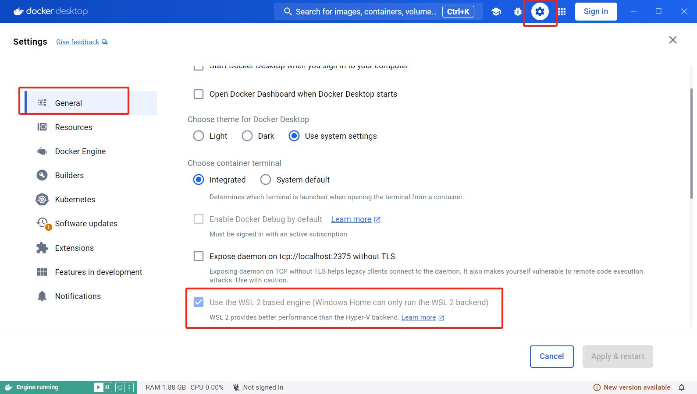
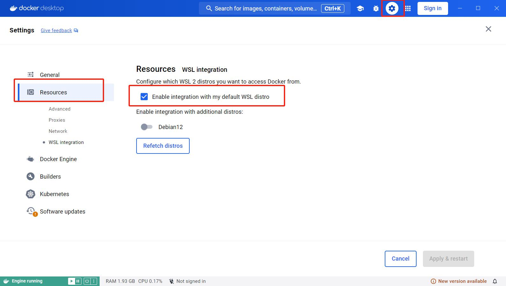
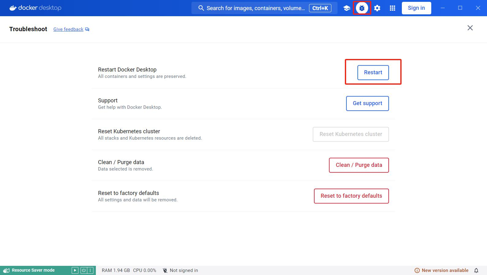
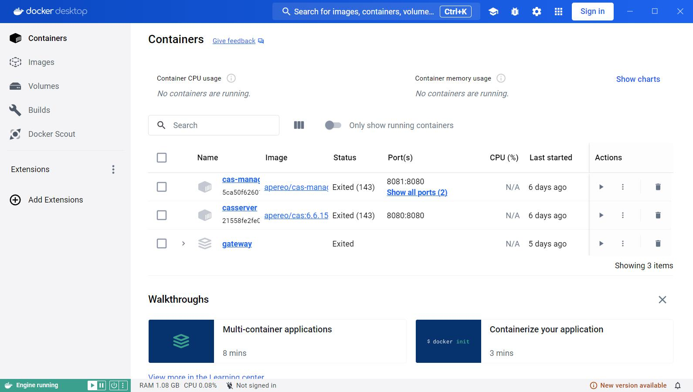

## 特性配置

1. 打开设置
2. 找到应用和特性
3. 开启windows功能与特性
4. 选中虚拟机平台和linux子系统
5. 需要在bios里面打开VT-X CPU虚拟化技术



## 使用命令行安装WSL

1. wsl本身集成在了windows上面
2. wsl有版本分wsl1和wsl2
3. 有的windows版本上面默认启动的是wsl1

```shell
#win键+r 输入并运行cmd
#检查wsl版本
wsl --version
#升级wsl
wsl --update
#查询支持的linux发行版本
wsl --list --online
#安装一个子系统
wsl --install Debian
#查询已安装的子系统
wsl --list
#运行子系统
wsl #会进入默认的子系统
```



## 安装docker

1. 下载Docker Desktop Installer.exe
2. 安装并运行
3. 设置windows子系统作为docker应用的后端



4. 配置哪些子系统内部可以访问docker应用




5. 配置完成后重启一下docker应用




### 安装成功后就可以享受容器带来的便利了

