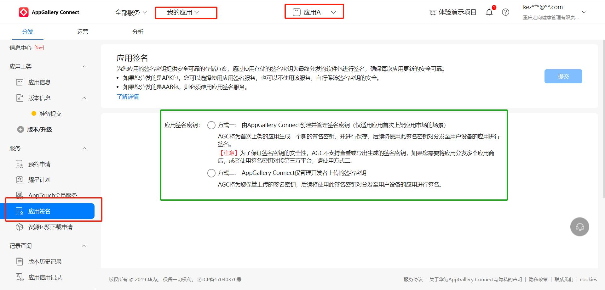

# 华为上架指南

## 账号申请

一般分个人开发者和企业开发者

1. 在开放平台创建appid

## 创建项目

1. 项目名称
2. 应用分类
3. 准备应用签名 一般是sha256

## 为项目添加应用

目的是获取APPID

### 基本信息

1. 应用名称
2. 设置分类(应用/游戏)
3. 设置包名
4. 语言

### 设置SDK

1. 配置文件(agconnect-services.json)
2. 添加sdk

* 设置项目级 build.gradle 添加华为仓库:https://developer.huawei.com/repo/
* 设置模块级 build.gradle 添加依赖:com.huawei.agconnect

### 设置应用签名

### 项目中配置APP的SHA256证书指纹

1. 从安卓store/jks证书查询
2. 在项目里面找到对应的APP配置证书指纹