# 项目架构

> 项目语言采用js、css、scss、html、vue3、前后端分别采用uniapp及unicloud平台，后端数据库为mongodb，会用到uniapp新特性uts编写原生插件、会涉及到Android原生的开发知识

## 开发工具 Hbuilder X 3.96

### 前置依赖工具

1. [git-bash](https://git-scm.com/downloads)
2. [tortoisegit](https://tortoisegit.org/download/)

### 下载安装Hbuilder X 3.96

[Hbuilder下载地址](https://www.dcloud.io/hbuilderx.html)

安装后运行并登录账号kezhuo@qq.com或协作账号

### 开发工具依赖插件 uts scss等安装

如果是新安装的HbuilderX是没有这些依赖的需要自行安装

步骤1: 先点击`Tool` 再打开 `plug-in installation`

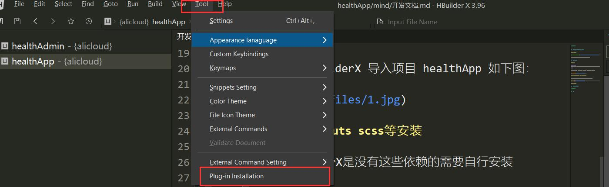

步骤2: 然后切换到`marketplace` 找到需要的依赖并 点单击`install`

安装完成之后最好`重启`一下HbuilderX

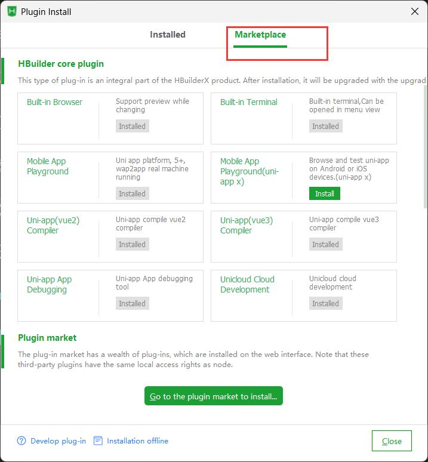

## unicloud后端

### 安装

使用`git`从gitcode拉取代码
``` shell
git clone https://gitcode.net/2301_81083289/healthAdmin.git
```

代码拉取完成后用 HbuilderX 导入项目 `healthAdmin` 如下图：

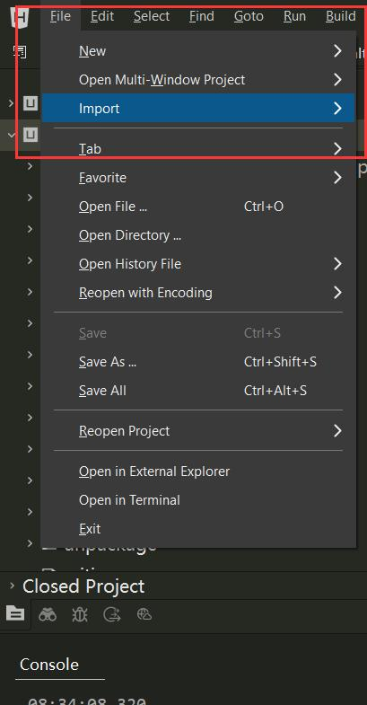

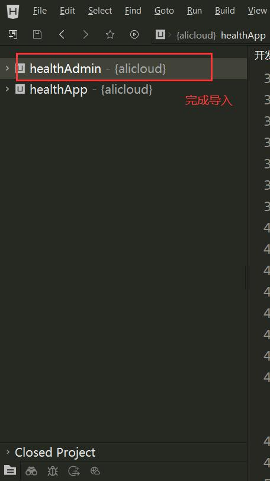

### 绑定云空间

云空间里面包含文件存储，数据库，短信，数据读写代码，所以项目运行前需要绑定云空间

空间绑定方式，首先在文件管理器里面展开项目目录`healthAdmin`，然后右键`uniCloud`目录，单击 `Current Cloud Space`，会弹出云空间选项，在关联选项卡中名为`app`的空间，点击`Link`完成关联

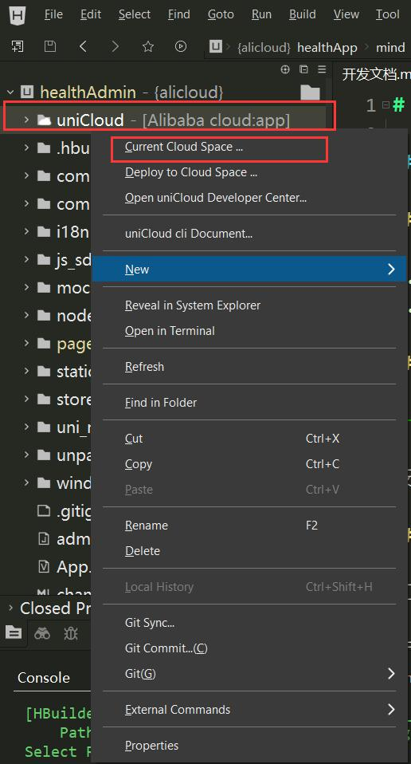

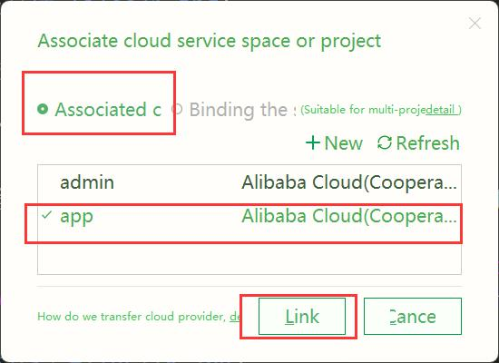


### 本地运行项目

在文件管理器栏选中`healtAdmin` 然后点击`run`，可以选择运行到浏览器(chrome,edge等)

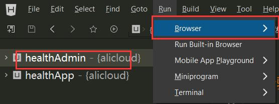

### 开发文档

#### 目录结构

```
healthAdmin
├── App.vue [VUE入口文件]
├── LICENSE 
├── README.md
├── admin.config.js [管理后台配置文件]
├── changelog.md 
├── common 
├── components
├── i18n
├── index.html
├── js_sdk
├── main.js [程序入口文件]
├── manifest.json [uni框架配置文件]
├── mock
├── node_modules
├── pages [VUE入口文件]
├── pages.json [页面及静态路由配置文件]
├── postcss.config.js 
├── static [静态文件目录]
├── store
├── template.h5.html
├── uni.scss
├── uniCloud-aliyun [云后端代码]
├── uni_modules [uni插件目录]
├── unpackage 
├── vue.config.js [VUE配置文件]
└── windows
```

项目各模块集中在`pages`目录下面
云后端代码集中在`uniCloud-aliyun`
uni插件在`uni_modules`
云后端代码会引用uni_modules下面的uniClouid目录，在`项目根目录/uniCloud` 中对引用文件的修改会对`uni_modules`下面的文件同步修改


`pages` 目录结构如下：

```
pages
├── demo
├── error
├── health-audios [音频管理模块]
├── health-events [活动事件管理模块]
├── health-events-teams [团队活动管理模块]
├── health-events-teams-members [团队活动成员管理模块]
├── health-events-teams-teams [团队活动团队管理模块]
├── health-members [会员管理模块]
├── health-steps [步数管理模块]
├── health-teams [团队管理模块]
├── health-teams-members [团队成员模块]
├── health-teams-ranks [团队排行模块]
├── index
├── opendb-feedback
├── system
└── uni-stat
```

`uniCloud-aliyun` 目录结构如下

```
uniCloud-aliyun
├── cloudfunctions [云函数/云对象目录]
└── database [数据表及触发器目录]
```

_所有`health`开头的目录或者文件都属于行者论健相关的功能模块_


#### 维护思路

> 维护是对现有代码的优化或缺陷调整，所以第一步就是定位问题所在，及相关程序文件位置

我们先在`chrome`里面运行项目，找到要优化的页面，然后看其路由地址，从路径`/#/pages/...`开始在 先到项目根目录下面的`pages.json`里面搜索对应的路径, 再定位到`pages`目录项目对应的文件，之后就是对应的vue文件了，vue参考vue官方文档。

如果是动态路由，则需要在管理后台的菜单管理界面查询一下路由相关文件如下图：

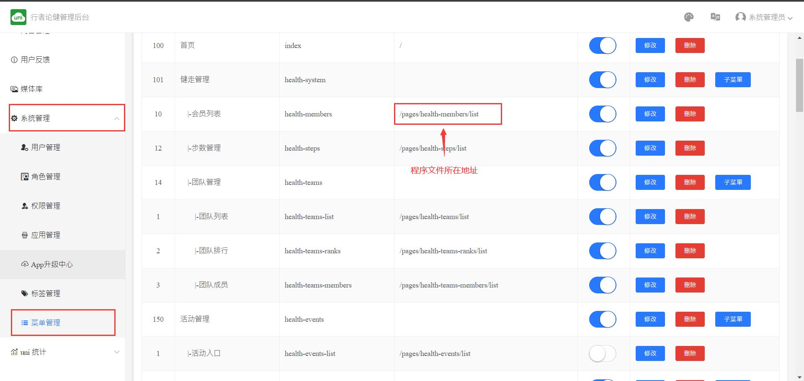

#### 开发思路

1. 建立数据表
2. schema2code(从数据表生成一些pages基础文件)
3. 对基础文件进行功能增强及完善
4. 在管理后台添加`菜单`


### H5项目部署

> 管理端软件分只有H5，所以仅需部署到云空间的前端网页托管

首先选中项目`healthAdmin`然后点击`Build` --> `Web`，会进入配置界面，可以配置`Web标题`，域名留空，选中`deploy to unicloud webhost`，选中需要部署的空间`app`，最后点击`deploy` 项目会进入构建阶段，完成后自动上传构建后的文件到webhost中，可以在unicloud后台的`前端网页托管地址`界面查看上传后的文件,[前端网页托管地址](https://unicloud.dcloud.net.cn/pages/web-host/web-host?pageid=mp-9f371d8a-548f-4bb1-a811-df557bf21066) 账号:kezhuo@qq.com

H5部署完成后可以用临时域名测试一下可否访问:https://
static-mp-9f371d8a-548f-4bb1-a811-df557bf21066.next.bspapp.com/admin/


## uniapp前端

### 安装

使用`git`从gitcode拉取代码：

``` shell
git clone https://gitcode.net/2301_81083289/healthApp.git
```

代码拉取完成后用 HbuilderX 导入项目 `healthApp` 如下图：


### 绑定云空间

云空间里面包含文件存储，数据库，短信，数据读写代码，所以项目运行前需要绑定云空间

空间绑定方式，首先在文件管理器里面展开项目目录`healthApp`，然后右键`uniCloud`目录，单击 `Current Cloud Space`，会弹出云空间选项，选中空间后，点击Link，我们选择绑定到`healthAdmin`的空间，与其共享一个云空间


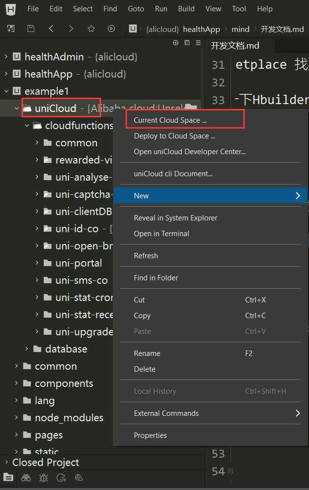

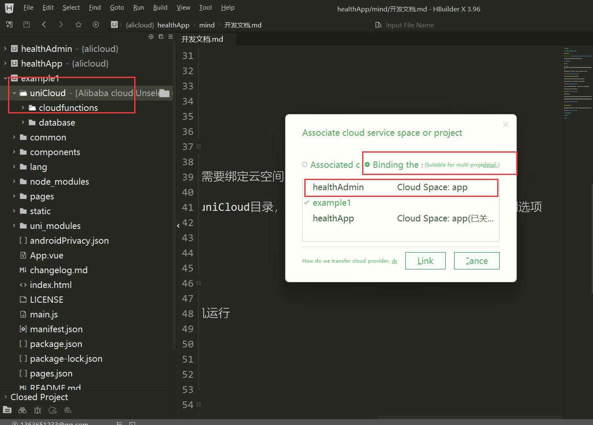


### 本地运行项目

在文件管理器栏选中`healtApp` 然后点击`run`，可以选择运行到浏览器或真机运行

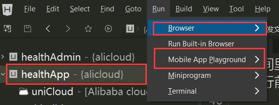

### 开发文档

#### 目录结构

```
healthApp
├── App.vue [VUE入口文件]
├── Gen_Signature_Android.apk [微信平台APP签名工具]
├── LICENSE
├── README.md
├── android.keystore [安卓证书]
├── changelog.md
├── common
├── components
├── index.html
├── js_sdk
├── keystore.txt [安卓证书信息及密钥]
├── lang
├── main.js [项目入口文件]
├── manifest.json [Uniapp配置文件]
├── mind [文档目录]
├── nativeplugins [本地原生插件目录]
├── node_modules
├── package-lock.json
├── package.json
├── pages [项目页面文件]
├── pages.json [页面配置文件路由文件]
├── pages1.json
├── static [静态资源目录]
├── test.xml
├── uni-starter.config.js [uni-starter 配置文件]
├── uni.scss
├── uniCloud-aliyun [云后端代码]
├── uni_modules [uni插件目录]
├── unpackage [打包输出目录]
└── wadb.apk [wifiAdb工具]
```

项目各模块集中在`pages`目录下面

```
pages
├── auth
├── autorun.vue
├── grid
├── health-appoints [预约模块]
├── health-cms [论健模块]
├── health-events [活动模块]
├── health-events-teams [团队活动模块]
├── health-events-teams-teams [团队活动团队模块]
├── health-members [会员模块]
├── health-steps [健走模块]
├── health-teams [团队模块]
├── health-teams-ranks [排行模块]
├── list
├── ucenter
└── uni-agree
```

#### 维护思路

> 维护是对现有代码的优化或缺陷调整，所以第一步就是定位问题所在，及相关程序文件位置

我们先在`chrome`里面运行项目，找到要优化的页面，然后看其路由地址，从路径`/#/pages/...`开始在 项目根目录下面的`pages.json`里面搜索对应的路径, 再定位到`pages`目录项目对应的文件，之后就是对应的vue文件了，vue参考vue官方文档

#### 开发思路

1. 建立数据表
2. schema2code(从数据表生成一些pages基础文件)
3. 对基础文件进行功能增强及完善


#### 真机调试

> 真机调试必须自定义基座打包

自定义基座打包前置条件:

1. 安卓证书及其密钥 见 根目录/android.keystore 及 keystore.txt

首先选中`healthApp`项目、点击`run`、点击`Mobile App Playground` 会进入打包配置界面

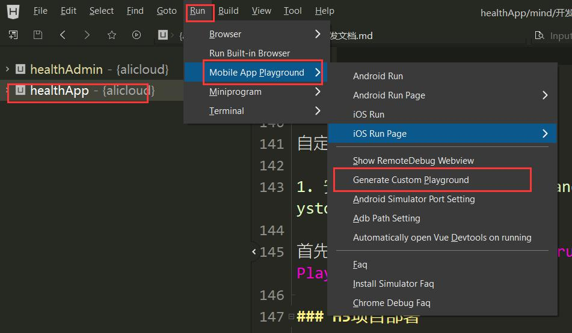

打包配置界面，具体配置如下图：

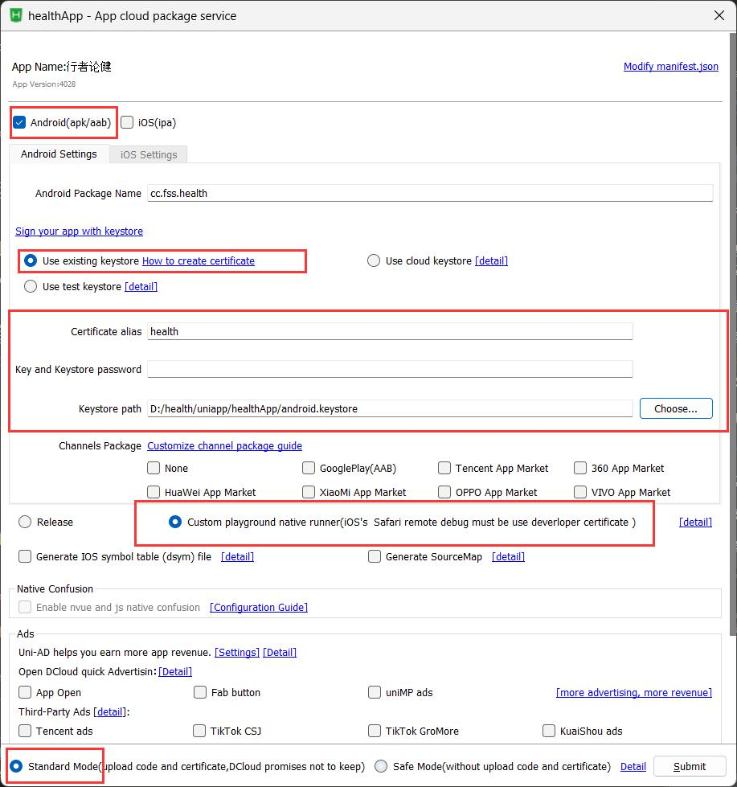

注意配置安卓证书和证书密钥

打包过程2-5分钟或者更长时间

打包过程如下图：

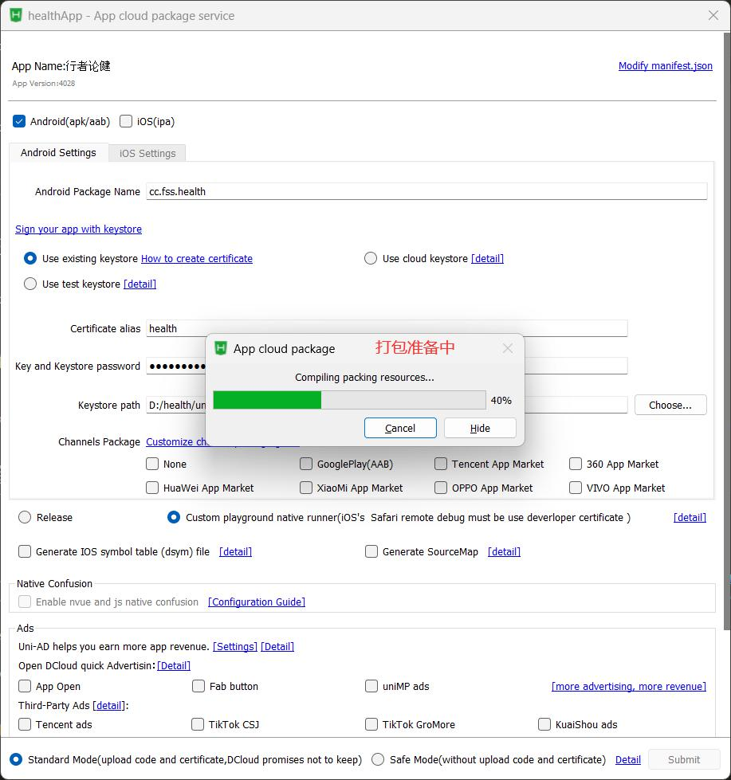

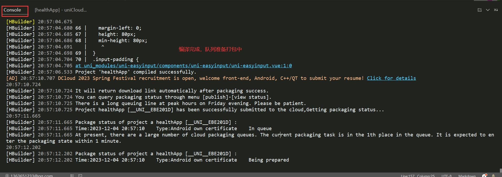

### H5项目部署

> 用户端软件分Android、H5，而分享功能依赖H5网页，所以部署H5必不可少

首先选中项目`healthApp`然后点击`Build` --> `Web`，会进入配置界面，可以配置`Web标题`，域名留空，选中`deploy to unicloud webhost`，选中需要部署的空间`app`，最后点击`deploy` 项目会进入构建阶段，完成后自动上传构建后的文件到webhost中，可以在unicloud后台的`前端网页托管地址`界面查看上传后的文件,[前端网页托管地址](https://unicloud.dcloud.net.cn/pages/web-host/web-host?pageid=mp-9f371d8a-548f-4bb1-a811-df557bf21066) 账号:kezhuo@qq.com

H5部署完成后可以用临时域名测试一下可否访问:https://
static-mp-9f371d8a-548f-4bb1-a811-df557bf21066.next.bspapp.com


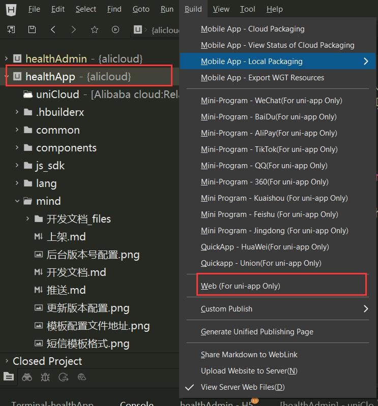

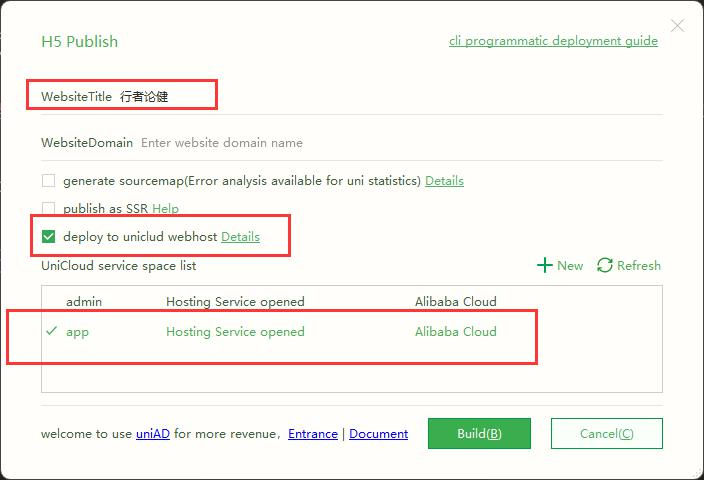

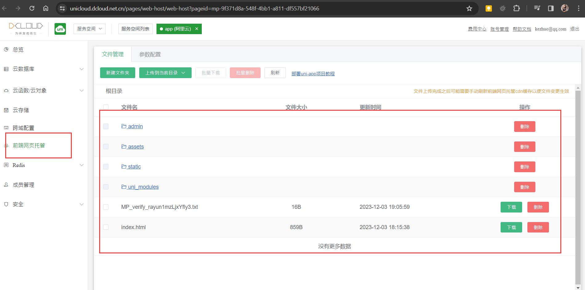

### APP打包

> APP打包和真机调试打包区别不大

打包前置条件:

1. 安卓证书及其密钥 见 根目录/android.keystore 及 keystore.txt

选中项目`healthApp`、点击`build`、点击`App Mobile Cloud packaging` 会进入打包配置界面

配置完成后点击`submit`，等待打包完成，


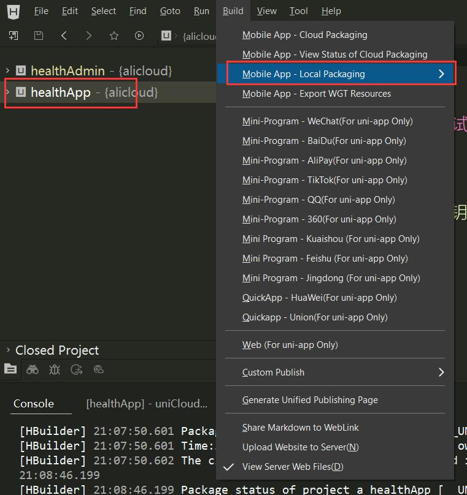

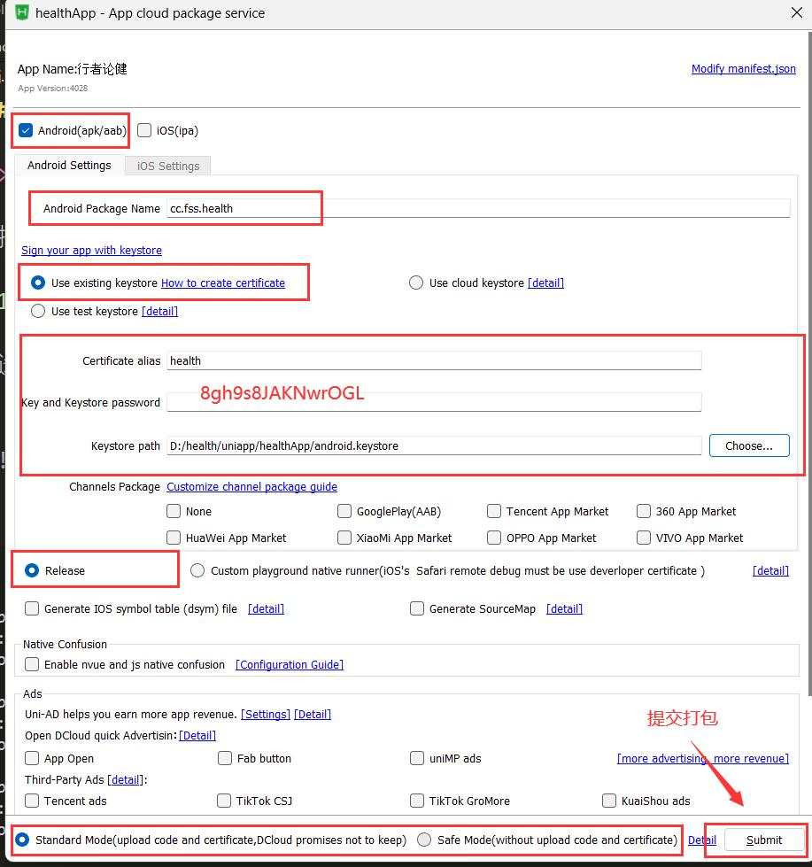

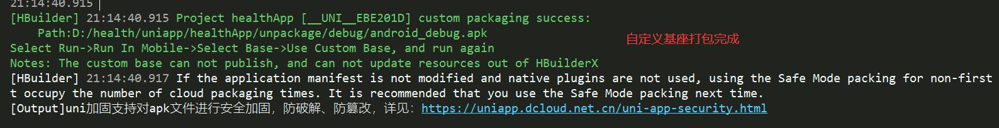