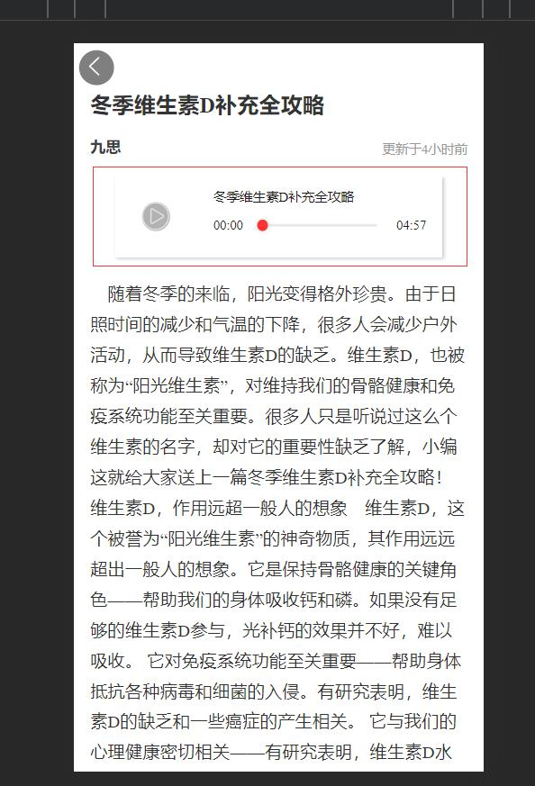

> 轮子虽多，就是不够圆润，最终还是得当个包装工


## 情况介绍 (2023/12/08 上午)

### H5

音频播放组件选用[CyAduio](https://ext.dcloud.net.cn/plugin?id=13574)

模样如下：



中规中矩，将就能用

微信内播放不能离开界面，微信切入后台后播放卡顿

### APP原生

只是采用`uni.getBackgroundAudioManager()`

几乎无UI

可点击播放可暂停

无状态无进度

弱体验


## 优化需求H5、APP统一UI、统一体验 (2023/12/08 下午)

### CyAudio组件代码

```vue
<template>
	<view class="audio-page">
		<view class="box-left">
			<image class="box-img" :src="props.image" mode="aspectFill"></image>
			<view class="page-btn" @click="clickAudio">
				<image :src="VF.music_play?VF.stop_img:VF.start_img" mode="widthFix"></image>
			</view>
		</view>
		<view class="box-content">
			<view class="content-name">{{props.title}}</view>
			<view class="progress">
				<text>{{getMinuteTime(VF.now_time)}}</text>
				<slider :value="VF.now_time/VF.total_time*100" block-size="10" block-color="#FF3333"
								activeColor="#FF3333" @change="sliderChange"></slider>
				<text>{{getMinuteTime(VF.total_time)}}</text>
			</view>
		</view>
	</view>
</template>
```
```typescript
import { onBeforeUnmount, onMounted, reactive } from 'vue';
interface Props {
	autoplay : boolean,
	music : string,
	image : string,
	title : number | string,
}
let props = withDefaults(defineProps<Props>(), {
	autoplay: false,
	music: '',
	image: '',
	title: '',
})

interface reactiveRules {
	music_play : boolean,
	AUDIO : any,
	total_time : any,
	now_time : any,
	timeupdata : any,
	interval : any,
	start_img : string
	stop_img : string
}

let VF = reactive<reactiveRules>({
	music_play: false,
	AUDIO: '',
	total_time: 0,
	now_time: 0,
	timeupdata: '',
	interval: '',
	start_img: "图片地址",
	stop_img: "图片地址"
})

onMounted(()=>{
	playAudio()
})

const getMinuteTime = (data : any) => {
	let minute : any = parseInt((data / 60).toString())
	let second : any = parseInt((data % 60).toString())
	if (minute.toString().length == 1) minute = `0${minute}`
	if (second.toString().length == 1) second = `0${second}`
	return `${minute}:${second}`
}

const clickAudio = () => {
	if (VF.music_play) {
		VF.music_play = false
		VF.AUDIO.pause()
	} else {
		VF.music_play = true
		VF.AUDIO.play()
	}
}

const sliderChange = (e : any) => {
	console.log(e)
	let second = e.detail.value / 100 * VF.total_time
	VF.AUDIO.seek(second)
	VF.now_time = second
}

const playAudio = () => {
	VF.AUDIO = uni.createInnerAudioContext()
	VF.AUDIO.src = props.music
	if (props.autoplay) {
		VF.AUDIO.autoplay = true
		VF.music_play = true
		VF.AUDIO.play()
	}
	VF.interval = setInterval(() => {
		if (VF.AUDIO.duration != 0 && !isNaN(VF.AUDIO.duration)) {
			VF.total_time = Math.round(VF.AUDIO.duration)
			console.log("音频时长", VF.total_time)
			clearInterval(VF.interval)
		}
	}, 100)
	VF.timeupdata = setInterval(() => {
		console.log(VF.now_time / VF.total_time * 100)
		if (VF.music_play) {
			VF.now_time++
			console.log("当前时间", getMinuteTime(VF.now_time))
			if (VF.now_time >= VF.total_time) {
				VF.music_play = false
				VF.now_time = 0
				// clearInterval(VF.timeupdata)
			}
		}
	}, 1000)
}
onBeforeUnmount(()=>{
	VF.music_play = false
	VF.AUDIO.pause()
	clearInterval(VF.timeupdata)
})
```

```scss
.audio-page{
	width: 600upx;
	height: 150upx;
	display: flex;
	align-items: center;
	justify-content: space-between;
	box-shadow: 3upx 3upx 6upx #ccc;
	.box-left{
		width: 150upx;
		height: 150upx;
		position: relative;
		display: flex;
		.box-img{
			width: 100%;
			height: 100%;
			position: absolute;
			left: 0;
			top: 0;
			z-index: 2;
		}
		.page-btn{
			width: 100%;
			height: 100%;
			display: flex;
			align-items: center;
			justify-content: center;
			position: absolute;
			left: 0;
			top: 0;
			z-index: 3;
			image{
				width: 50upx;
				height: 50upx;
				background-color: rgba($color: #000000, $alpha: 0.3);
				border-radius: 50%;
			}
		}
	}
	.box-content{
		width: 450upx;
		height: 100%;
		display: flex;
		flex-direction: column;
		justify-content: center;
		padding: 0 30upx;
		box-sizing: border-box;
		font-size: 24upx;
		.content-name{
			width: 100%;
			display: -webkit-box;/* 弹性盒模型 */
			-webkit-box-orient: vertical;/* 元素垂直居中*/
			-webkit-line-clamp: 1;/*  文字显示的行数*/
			overflow:hidden;/* 超出隐藏 */
		}
		.progress{
			width: 100%;
			display: flex;
			align-items: center;
			justify-content: space-between;
			slider{
				width: 80%;
			}
		}
	}
}
```

### 重点关注代码段

```typescript
const playAudio = () => {
	VF.AUDIO = uni.createInnerAudioContext()
	VF.AUDIO.src = props.music
	if (props.autoplay) {
		VF.AUDIO.autoplay = true
		VF.music_play = true
		VF.AUDIO.play()
	}
	VF.interval = setInterval(() => {
		if (VF.AUDIO.duration != 0 && !isNaN(VF.AUDIO.duration)) {
			VF.total_time = Math.round(VF.AUDIO.duration)
			console.log("音频时长", VF.total_time)
			clearInterval(VF.interval)
		}
	}, 100)
	VF.timeupdata = setInterval(() => {
		console.log(VF.now_time / VF.total_time * 100)
		if (VF.music_play) {
			VF.now_time++
			console.log("当前时间", getMinuteTime(VF.now_time))
			if (VF.now_time >= VF.total_time) {
				VF.music_play = false
				VF.now_time = 0
				// clearInterval(VF.timeupdata)
			}
		}
	}, 1000)
}
```

用到了`uni.createInnerAudioContext`方法

此方法是不能在后台播放音频的所以得整改为`uni.getBackgroundAudioManager()`

并且VF.AUDIO对象目前仅作用于局部而不是全局

思路是将对象保存到App.vue 的globalData区域

用一个方法包裹`uni.getBackgroundAudioManager()`的创建

且需要考虑H5端只能用`uni.createInnerAudioContext`

所以以下代码得做条件编译见：`#ifdef`

__播放管理器逻辑层封装如下：__

```javascript
const getAudioManager = () => {
	function getPlayer() {
		if(getApp().globalData?.audioManager) {
			return getApp().globalData?.audioManager
		} else {
			// #ifdef H5
			getApp().globalData.audioManager = uni.createInnerAudioContext()
			// #endif
			// #ifdef APP
			getApp().globalData.audioManager = uni.getBackgroundAudioManager()
			// #endif
			return getApp().globalData.audioManager
		}
	}
	
	let player = getPlayer()
	
	const initPlayer = function(audio) {
		// #ifdef APP
		this.player.title = audio.file?.name;
		this.player.singer = audio.singer;
		this.player.coverImgUrl = audio.coverImgUrl;
		this.player.src = audio.file?.url
		// #endif
		// #ifdef H5
		this.player.src = audio.file?.url
		// #endif
	}
	const play = function() {
		this.player.play()
	}
	const pause = function() {
		this.player.pause()
	}
	
	return {
		player,
		initPlayer,
		play,
		pause,
	}
}
```

之后对音频的操作都是对`getAudioManager()`返回的修改

### 为getBackgroundAudioManager配置参数

__UI层需要对接的代码如下：__

```javascript

const audioManager = getAudioManager()
/**
 * audio,
 * onTimeUpdate
 * onEnded
 * 应该由props传递
 */
const audio = {
	file: {
		name: "音频文件",
		url: "音频网络地址" 
	},
	singer: "歌手",
	coverImgUrl: "https://qiniu-web-assets.dcloud.net.cn/unidoc/zh/music-a.png"
}
const onTimeUpdate = () => {}
const onEnded = () => {}

// 播放事件更新回调
audioManager.player.onTimeUpdate(onTimeUpdate)
// 播放结束回调
audioManager.player.onEnded(onEnded)

audioManager.initPlayer(audio)
audioManager.play()
audioManager.pause()
```

> getBackgroundAudioManager 只能播放在线音频，无法播放本地音频

关于getBackgroundAudioManager更多参数详细见：
[getBackgroundAudioManager文档](https://uniapp.dcloud.net.cn/api/media/background-audio-manager.html)


### 音频组件状态更新

播放、暂停、停止、时间更新都可以走onTimeUpdate

```javascript  
// 是个无参数方法 可以读取getAudioManager().player 做对比
onTimeUpdate(() => {
	const player = getAudioManager().player
})
```


### 组件开发步骤

1. 在uni_modules模块下面创建组件目录lyh-audio-player
2. 将CyAudio代码移入
3. 根据上面得思路调试代码


## 版本的缺陷 (2023/12/09)

1. 全局无法跟踪音频播放进度
2. 无法跟踪每个音频的播放进度
3. 无法记录用户的播放历史

### 整改思路

1. 全局播放器要记录播放过的音频
2. 并且要记录播放的进度

针对第一点的做法是重新封装全局的音频管理器`audioManager`
```javascript
// initManager.js
export default function initManager() {
	if (getApp().globalData?.audioManager) {
		return getApp().globalData?.audioManager
	} else {
		
		// #ifdef H5
		let player = uni.createInnerAudioContext()
		// #endif
		// #ifdef APP
		let player = uni.getBackgroundAudioManager()
		// #endif
		
		getApp().globalData.audioManager = {
			player: player, // 平台提供的播放器实例
			audios: [], // 音频播放列表, 记录有播放进度信息
			currentAudio: null, // 当前播放的音频
			// 添加音频到列表
			addAudio: function(audio) {
				if(!this.audios.map(audio => audio.id).includes(audio.id)) {
					this.audios.push(audio)
				}
			},
			// 根据音频ID获取音频
			getAudio: function(audio_id) {
				return this.audios.find(audio => audio.id == audio_id)
			},
			// 播放当前音频
			play: function() {
				this.player.src = this.currentAudio.file?.url	
				// #ifdef APP
				this.player.title = this.currentAudio.file?.name;
				this.player.singer = this.currentAudio.singer;
				this.player.coverImgUrl = this.currentAudio.coverImgUrl;
				this.player.onCanplay(() => {
					this.seek(this.currentAudio.now_time, this.currentAudio.id)
				})
				// #endif
				// #ifdef H5
				this.seek(this.currentAudio.now_time, this.currentAudio.id)
				// #endif
				this.player.play()
			},
			// 暂替播放
			pause: function() {
				this.player.pause()
			},
			// 跳转指定时间
			seek: function (time, audio_id) {
				if(this.currentAudio && this.currentAudio.id == audio_id) {
					this.currentAudio.now_time = time
					this.player.seek(time)
				} else {
					const audio = this.audios.find(audio => audio.id == audio_id)
					if(audio) {
						audio.now_time = time
						console.log("seek 音频;"+JSON.stringify(audio))
					}
				}
			},
			/**
			 * 播放指定音频
			 * @param {Object} audio
			 * 播放前先暂停播放
			 * 在异步开启播放
			 * 这样防止player上面的异步事件重写
			 */
			playAudio: function(audio) {
				this.player.pause()
				setTimeout(() => {
					const exist = this.getAudio(audio.id)
					if(exist) {
						this.currentAudio = exist
					} else {
						this.addAudio(audio)
						this.currentAudio = audio
					}				
					
					this.play()
				}, 1000);
			}
		}
		return getApp().globalData.audioManager
	}
}
```

> 这个`initManager`可以独立使用，开发者有需要可行拓展

```javascript
//lyh-audio-player 中应用initManager
import initManager from '../initManager.js'

const audioManager = initManager()

const audio = {
	id: props.id,
	file: {
		name: props.title,
		url: props.music
	},
	singer: "",
	coverImgUrl: props.image
}

audioManager.addAudio(audio)

audioManager.pause()

audioManager.playAudio(audio)

audioManager.seek(time)

audioManager.player.onEnded(() => {})

audioManager.player.onTimeUpdate(() => {})
```

## 总结 (2023/12/10 上午 09:40)

__至此带播放记录的音频播放器开发完成__

从这个事件被提出，历时两天，其中包含文档思路解析、开发用时和问题调试修复,

且版本有2个：

1. 版本1当时没有考虑播放记录问题，是在开发完成后测试时发现的问题，既然开发完了也只得硬头皮发布了。

2. 版本2在1版本的基础上面引入播放记录的问题，在真机APP调试时也遇到了问题，也就是H5和原生的播放器seek方式是不同的，这个是在记录播放进度才产生的问题，版本1并没表现出来，所以调试花费了点时间。

播放器虽然还不够完美，例如目前只在内存中记录了播放进度，用户关闭浏览器后是会重置播放记录的。没有提供一个audioManager的UI。

希望接下来有机会完善吧。